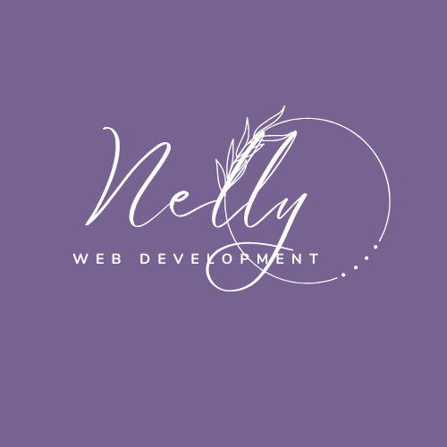
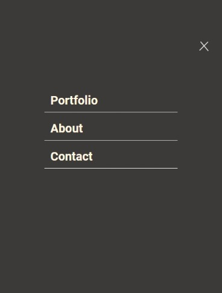

  
   
  <h3><b>Portfolio README</b></h3>
   

  

<!-- TABLE OF CONTENTS -->

# Table of Contents 📋

- [About the Project](#about-project)
  - [Screenshot](#screenshot)
  - [Built With](#built-with)
    - [Tech Stack](#tech-stack)
    - [Key Features](#key-features)
  - [Live Demo](#live-demo)
- [Getting Started](#getting-started)
  - [Setup](#setup)
  - [Prerequisites](#prerequisites)
  - [Install](#install)
  - [Usage](#usage)
  - [Run tests](#run-tests)
  - [Deployment](#deployment)
- [Author](#author)
- [Future Features](#future-features)
- [Contributing](#contributing)
- [Show your support](#support)
- [Acknowledgements](#acknowledgements)
- [FAQ (OPTIONAL)](#faq)
- [License](#license)

     
     
<!-- PROJECT DESCRIPTION -->

# <b>Portfolio</b> 📖

This is a portfolio website is designed to show what I'm really capable of as a web developer. 
  
## <b>Screenshot 📷</b>

The screenshot below is a desktop version of the design.

 
   

 

(<a href="#readme-top">back to top</a>)

  

## <b>Built With 🛠</b> 

### <b>Tech Stack </b>

This portfolio is build with:

* Semantic <b>HTML5</b> markup to build raw structure of this web page
* <b>CSS</b> custom properties to make the website visually attractive
* <b>Node js</b> as a javascript runtime machine
[git], a free and open source distributed version control system
* <b>Linters</b> for coding convention and coding formating
  

<!-- Features -->

### <b>Key Features</b> 

> Coming soon...

(<a href="#readme-top">back to top</a>)

  

<!-- LIVE DEMO -->

## <b>Live Demo 🚀</b> 

> Unfortunatly, there is not live demonstration avalaible right now 😭

(<a href="#readme-top">back to top</a>)

    
<!-- GETTING STARTED -->

## <b>Getting Started 💻</b>

> Coming soon...

  

### Prerequisites

> Coming soon...

### Setup

> Coming soon...

### Install

> Coming soon...

### Usage

> Coming soon...

### Run tests

> Coming soon...

  

### <b>Deployment</b>

> Coming soon...

(<a href="#readme-top">back to top</a>)

  
<!-- AUTHORS -->

## <b>Author 👤</b>

 

Want to get in touch with me? Here are my social links:
> [GitHub](https://github.com/lily4178993/)  

> [Twitter](https://twitter.com/nelly_telli)  

> [LinkedIn](https://www.linkedin.com/in/nelly-t-330414266/)

(<a href="#readme-top">back to top</a>)

  
<!-- FUTURE FEATURES -->

##  <b>Future Features 🔭</b>

 
In the near future, I plan to add:

- [ ] **the complete mobile version**
- [ ] **a contact form** 
- [ ] **a complete desktop version** 
- [ ] **a contact form**
I also plan to **deploy the portfolio** 

(<a href="#readme-top">back to top</a>)

<!-- CONTRIBUTING -->

## <b>Contributing 🤝 </b>

 
Contributions, issues, and feature requests are welcome!
Feel free to check the [issues page](https://github.com/lily4178993/Portfolio/issues).

(<a href="#readme-top">back to top</a>)

  
<!-- SUPPORT -->

## <b>Show your support ⭐️ </b>

 

Do you like this project? 
Don't hesitate to vote! Kindly leave a comment below and share it with someone who enjoys coding!
This will help me gain visibility, but more importantly, it will facilitate access to other people.

(<a href="#readme-top">back to top</a>)

  
<!-- ACKNOWLEDGEMENTS -->

## <b>Acknowledgments 🙏 </b>

 

I am grateful to [Microverse](https://github.com/microverseinc) for the opportunity they have given me.

(<a href="#readme-top">back to top</a>)

   
<!-- LICENSE -->

## 📝 License 

 

This project is [MIT](./LICENSE) licensed.

(<a href="#readme-top">back to top</a>)
