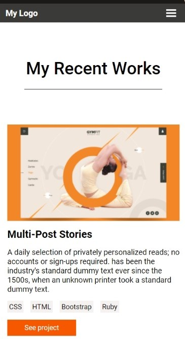
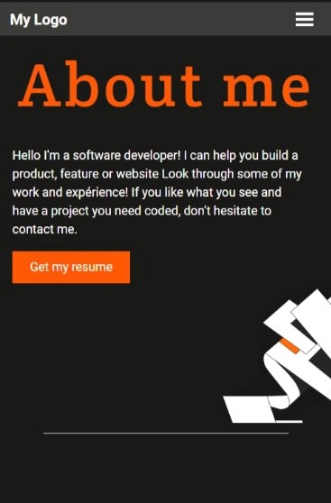

<a name="readme-top"></a>
<hr>

<div align="center">
  
  <br/>
  <h1><b>Portfolio</b></h1>
</div>

<hr> <br/>

<!-- TABLE OF CONTENTS -->

## <b>Table of Contents 📋

- [About the Project](#about-project)
  - [Screenshot](#screenshot)
  - [Built With](#built-with)
    - [Tech Stack](#tech-stack)
    - [Key Features](#future-features)
  - [Live Demo](#live-demo)
- [💻 Getting Started](#getting-started)
  - [Prerequisites](#prerequisites)
  - [Setup](#setup)
  - [Deployment](#deployment)
- [Author](#author)
- [Future Features](#future-features)
- [Contributing](#contributing)
- [Show your support](#support)
- [Acknowledgements](#acknowledgements)
- [License](#license)
</b>
<hr><hr>

<!-- ABOUT PROJECT -->

## <b>Portfolio</b> 📖<a name="about-project"></a>

This is a portfolio website is designed to show what I'm really capable of as a web developer.
<br><hr>
<!-- SCREENSHOT -->

## <b>Screenshot 📷</b><a name="screenshot"></a><hr />

The screenshot below is a mobile version of the portfolio.
<div align="center">
<br/>
 <br/><br/>
 <br/><br/>

</div><br/>
<p align="right">(<a href="#readme-top">back to top</a>)</p>
<br><hr>

<!-- BUILT WITH -->

## <b>Built With 🛠</b> <a name="built-with"></a><br>

<!-- TECH STACK -->

### <b>Tech Stack 🗜️</b><a name="tech-stack"></a>

This portfolio is build with:

<ul>
    <li><a href="https://developer.mozilla.org/en-US/docs/Web/HTML">HTML5</a> markup to build raw structure of this web page</li><br>
    <li><a href="https://developer.mozilla.org/en-US/docs/Web/CSS">CSS3</a> custom properties, <a href="https://css-tricks.com/snippets/css/a-guide-to-flexbox/">FlexBox</a>, <a href="">Grid</a> to make the website visually attractive</li><br>
    <li>Javascript for dynamic functionality</li><br>
    <li><a href="">Node JS</a> as a javascript runtime machine [git], a free and open source distributed version control system</li><br>
    <li><a href="https://mozilla.github.io/addons-linter/">Linter tool</a> that analyzes my source code to flag programming errors, bugs, stylistic
errors, and suspicious constructs.</li>
  </ul>

<p align="right">(<a href="#readme-top">back to top</a>)</p>
<br><hr>

<!-- KEY FEATURES -->

### <b>Key Features 🏷️</b> <a name="key-features"></a>

- **The project is UI responsive.💯**
- **The section "recent works" was created dynamically in JavaScript.**

<p align="right">(<a href="#readme-top">back to top</a>)</p>
<br><hr>

<!-- LIVE DEMO -->

## <b>Live Demo 🚀</b> <a name="live-demo"></a>

This Portfolio website is hosted on [GitHub pages](#deployment), so if you want to check it online, please 😊 [Click here](https://lily4178993.github.io/Portfolio/).
<p align="right">(<a href="#readme-top">back to top</a>)</p>
<hr>

<!-- GET STARTED -->

## <b>Getting Started 💻</b><a name="getting-started"></a>

Before proceeding to the installation phase, you must ensure that you meet the following prerequisites...

<!-- PREREQUISITIES -->
### <b>Prerequisites 🧱</b><a name="prerequisites"></a>

In order to run this project you need:
- A web browser to view output e.g [Microsoft Edge](https://www.microsoft.com/en-us/edge).
- The latest Long-term support version of [Node js](https://nodejs.org/en)
- An IDE e.g [Visual studio code](https://code.visualstudio.com/).
- [A terminal](https://code.visualstudio.com/docs/terminal/basics).

<br><hr>
<!-- SETUP -->

### <b>Setup ⚙️</b><a name="setup"></a>

In order to run this project you need to:

- open your code editor
- Clone this repository to your desired folder:

```sh
    git clone https://github.com/lily4178993/Portfolio.git
```
- Navigate to the folder
```
cd Portfolio
```
- Checkout the branch
```
git checkout main
```
<br><hr>

<!-- INSTALL -->

### <b>Install 🏗️</b><a name="install"></a>

Install all dependencies:

```sh
    npm install
```
<br><hr>
<!-- USAGE -->

### <b>Usage 📂</b><a name="usage"></a>

To run the project, follow these instructions:

- You have to clone this repo to your local machine.
```
git clone https://github.com/lily4178993/Portfolio
```

- If you want to run it on your preferred browser, open <b>index.html</b> or <b>about.html</b>.

<!-- TESTS -->
<br><hr>
### <b>Run tests 🧪</b><a name="run-tests"></a>

How should it be tested? 
To run tests, run the following command:

- HTML linter errors run:

```
npx hint . --fix
```

- CSS linter errors run:

```
npx stylelint "**/*.{css,scss}" --fix
```

- JavaScript linter errors run:

```
npx eslint . --fix
```

- For unit testing, run:

```
npm test
```
<br><hr>

<!-- DEPLOYEMENT -->

### <b>Deployment</b> <a name="deployment"></a>

You can deploy this project using: GitHub Pages, [Vercel](https://vercel.com/) or [Netlify](https://www.netlify.com/).

I used GitHub Pages to host my website. For more information about how to use GitHub pages [read here](https://www.w3schools.com/git/git_remote_pages.asp?remote=github) 🤩. If you want to watch a video about how to use GitHub pages instead of reading [click here](https://www.youtube.com/watch?v=QyFcl_Fba-k&t=251s) ☺️.

<p align="right">(<a href="#readme-top">back to top</a>)</p>

<br><hr>
<!-- AUTHOR -->

## <b>Author 👤</b><a name="author"></a>
<hr /><br/>

Want to get in touch with me 📲? Here are my social links:
> [GitHub](https://github.com/lily4178993/) <br/><hr />
> [Twitter](https://twitter.com/nelly_telli) <br/><hr />
> [LinkedIn](https://www.linkedin.com/in/nelly-t-330414266/)

<p align="right">(<a href="#readme-top">back to top</a>)</p>

<br><hr>
<!-- FUTURE FEATURES -->

## <b>Future Features 🔭</b><a name="future-features"></a>

In the near future, I plan to add:

- [ ] **more recents projects**

<p align="right">(<a href="#readme-top">back to top</a>)</p>

<br><hr>
<!-- CONTRIBUTING -->

## <b>Contributing 🤝 </b><a name="contributing"></a>

If you have suggestions 📝, ideas 🤔, or bug reports 🐛, please feel free to open an [issue](https://github.com/lily4178993/Portfolio/issues) on GitHub.
Remember, every contribution, no matter how big or small, makes a difference.

<p align="right">(<a href="#readme-top">back to top</a>)</p>

<br><hr>
<!-- SUPPORT -->


## <b>Show your support 🌟</b><a name="support"></a>

Thank you for taking the time to explore my GitHub project! Your support means a lot to me. If you find my project valuable and would like to contribute, here are a few ways you can support me:

 - <b>Star the project ⭐️</b>: Show your appreciation by starring this GitHub repository. It helps increase visibility and lets others know that the project is well-received.

 - <b>Fork the project 🍴 🎣</b>: If you're interested in making improvements or adding new features, feel free to fork the project. You can work on your own version and even submit pull requests to suggest changes.

 - <b>Share with others 🗺️</b>: Spread the word about this project. Share it on social media, mention it in relevant forums or communities, or recommend it to colleagues and friends who might find it useful.

<p align="right">(<a href="#readme-top">back to top</a>)</p>

<br><hr>
<!-- ACKNOWLEDGEMENTS -->

## <b>Acknowledgments 🙏</b><a name="acknowledgements"></a>


I would like to express my sincere gratitude to [Microverse](https://github.com/microverseinc), the dedicated reviewers, and my partners: [kit0-0](https://github.com/kit0-0) and [Mike111222](https://github.com/Mike111222). Your unwavering support, feedbacks, and collaborative efforts have played an immense role in making my journey a resounding success. Thank you for being an integral part of my achievements.

<p align="right">(<a href="#readme-top">back to top</a>)</p>

<!-- LICENCE -->

## <b>License 📝</b><a name="license"></a>

This project is [MIT](./LICENSE) licensed.

<p align="right">(<a href="#readme-top">back to top</a>)</p>
